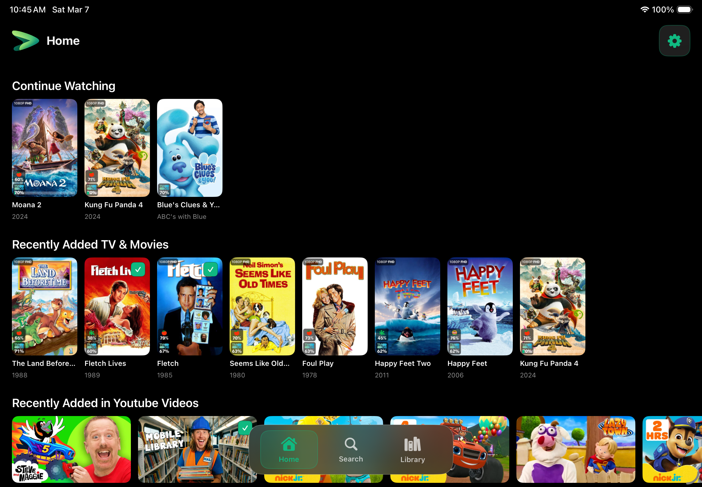
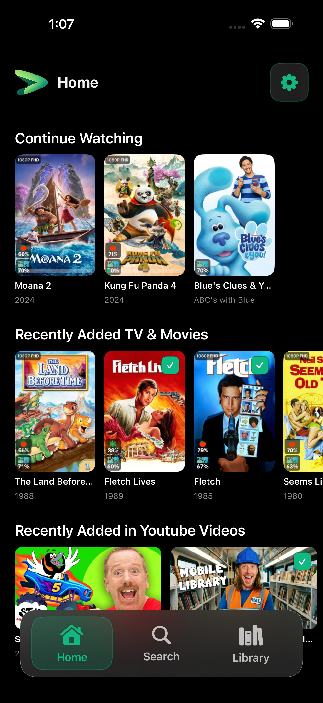
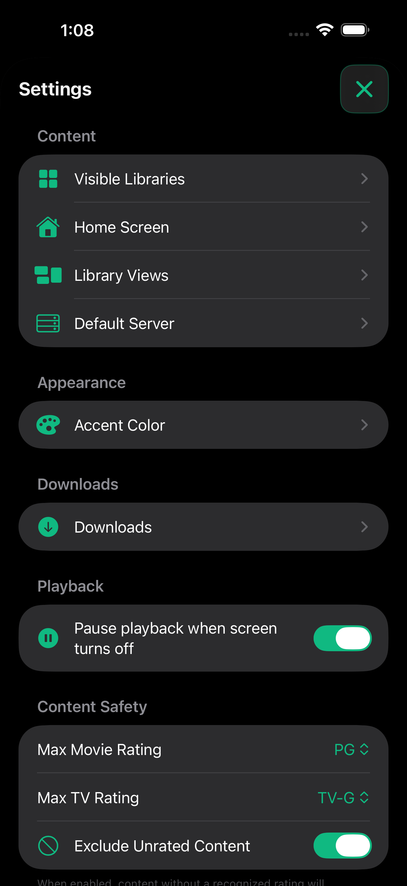

# Plinx

A safe, playful Plex client designed specifically for kids. Browse, search, and watch your family's media library on your own, with built-in parental controls to keep age-appropriate content front and center.

**Download from the App Store:** [Download Plinx](https://www.apple.com/app-store) (coming soon)

---

## What Makes Plinx Different

**Safety First**
- Content is automatically filtered by age-appropriate ratings (G through PG for movies, TV-Y through TV-PG for shows)
- Parents control settings access via a math challenge or PIN
- No external links, no social features, no data collection

**Easy for Kids**
- Large buttons and responsive touch targets
- Clean interface with a floating tab bar
- Continue Watching picks up where you left off
- Playful animations and haptic feedback on every tap

**Flexible for Families**
- Multiple Plex Home profile support
- Customize which libraries are visible
- Reorder home screen sections to suit your preferences
- 8 accent colors to personalize the interface
- Download movies for offline viewing

---

## Key Features

**Home Screen**  
Recently added movies, shows, and videos grouped into easy-to-browse rows. Personalize the order and choose which libraries to display. Long-press any item for quick actions: play, continue, download, or add to wishlists.

**Library Browsing**  
Browse by library with recommended sections, full grids with sorting, and optional collections. Libraries with YouTube, home videos, or clips automatically switch to landscape format for the best viewing angle.

**Search**  
Full-text search across your Plex server. All results are filtered by the active rating policy, so inappropriate content never shows up in search results.

**Downloads**  
Download movies and shows for offline playback on the go. Choose your preferred download quality to balance file size and video quality. Manage downloads with a simple grid or list view.

**High-Quality Playback**  
Stream with support for 4K, HDR, Dolby Vision, and multiple audio tracks. Pick up where you left off with automatic bookmarking. Picture-in-picture supported for multitasking.

**Parental Controls**  
- Rating ceilings for both movies and TV shows
- Math challenge or numeric PIN to protect settings
- Touch lock to prevent accidental home button presses
- Volume limiter
- Auto-stop when screen turns off
- Per-library visibility controls

**Customization**  
- 8 accent colors to choose from
- Adjustable button sizes (small, medium, large)
- Optional playful animations on interactions
- Combine or split movie and TV home rows
- Show or hide library recommendation hubs per library

---

## Screenshots

**iPad Experience**

<table>
<tr>
<td align="center"> Home Screen</td>
<td align="center"> Library Selection</td>
<td align="center"> Settings</td>
</tr>
</table>

**iPhone Experience**

<table>
<tr>
<td align="center"> Home Screen</td>
<td align="center"> Library</td>
<td align="center"> Settings</td>
</tr>
</table>

---

## Getting Started

1. Download Plinx from the App Store (coming soon)
2. Sign in with your Plex account
3. Choose a Plex Home profile (and PIN if protected)
4. Select your Plex Media Server
5. Start browsing and watching

You'll need an existing Plex Media Server on your home network or accessible via Plex Relay/Remote Access.

---

## Settings

All settings require passing the parental gate (math challenge or PIN) to access.

### Navigation & Content
- Visible Libraries
- Home Screen layout and section order
- Library recommendation hubs (per-library)
- Default Plex Server
- Search tab placement

### Appearance
- Accent color (8 preset colors)
- Button size
- Animation preference

### Playback
- Pause when screen turns off
- Download quality

### Safety
- Movie and TV rating ceilings
- Unrated content handling
- Maximum playback volume
- Touch lock (Baby Lock)
- Parental PIN configuration

### Account
- Switch Plex Home profile
- Change server
- Log out

---

## Privacy & Safety

All content is filtered before display using configurable content ratings. Settings are protected by a parental gate (math challenge or PIN).

**Zero data collection.** Plinx does not collect usage data, crash reports, or telemetry. All communication is directly between the app and your Plex Media Server. See [PRIVACY_POLICY.md](PRIVACY_POLICY.md) for the full privacy policy.

---

## Built on Strimr

Plinx is built on the open-source [Strimr](https://github.com/wunax/strimr) Plex client, which provides core features like playback, downloads, and library browsing. We've added a kid-safe interface with parental controls, clip/video library support, and download quality options.

---

## For Developers

Want to build, contribute, or run Plinx locally? See [development/SETUP.md](development/SETUP.md) for setup instructions.

The app is open source under GPL-3.0. See [LICENSE](LICENSE) for details.

---

## Support

Have questions or feedback? Open an issue on [GitHub](https://github.com/bballdavis/Plinx/issues).

---

## License

Plinx is licensed under GPL-3.0, the same terms as Strimr. See [LICENSE](LICENSE) for details.
