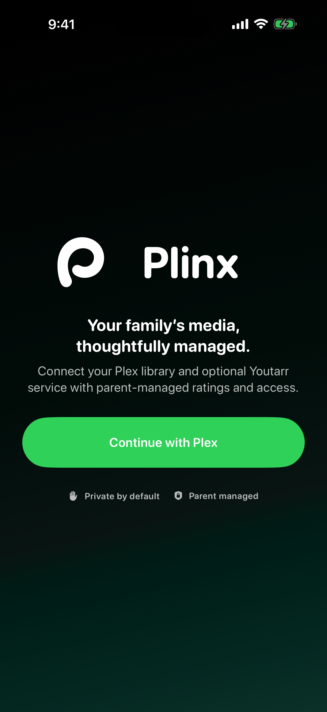
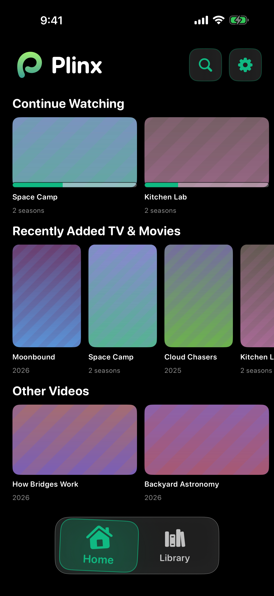
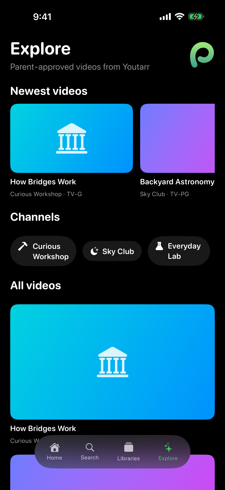
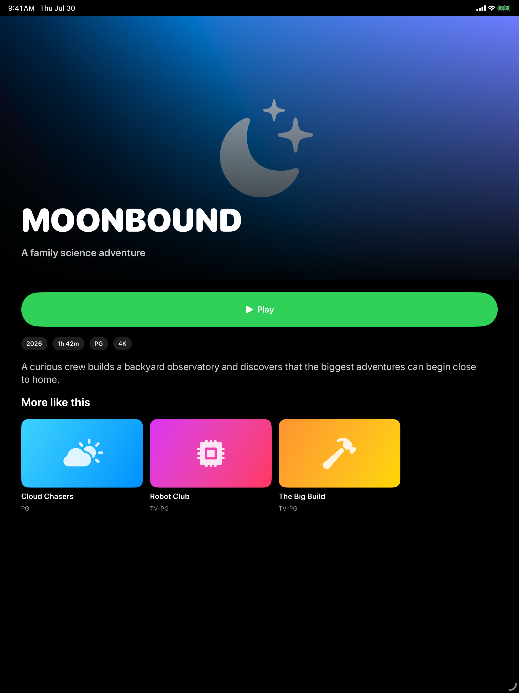
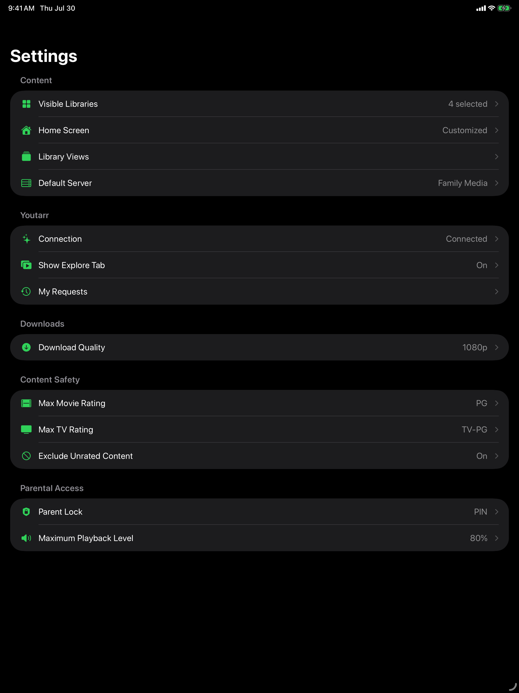
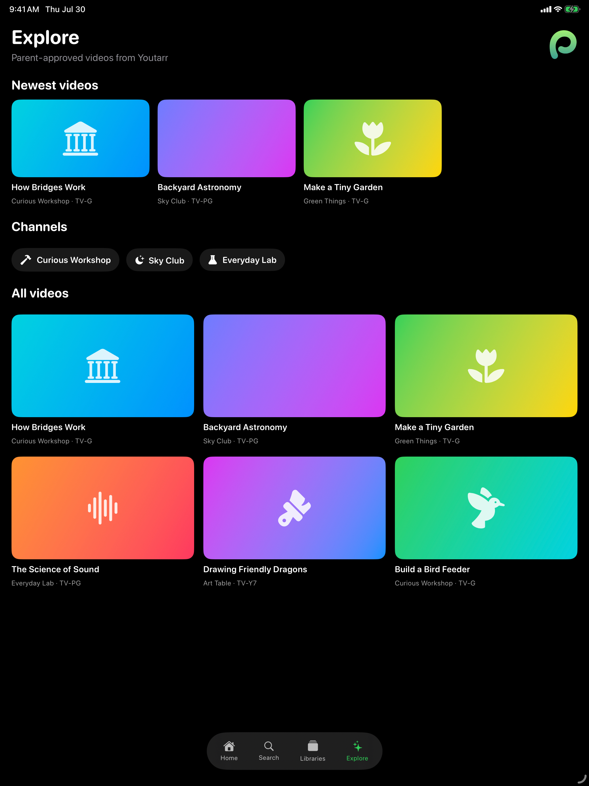

<h1>
  
</h1>

A playful, parent-managed Plex client for family media. Browse, search, and watch a parent-selected Plex library with configurable rating ceilings, library visibility, offline access, and optional Youtarr video discovery and requests.

  (coming soon)

---

## What Makes Plinx Different

**Safety First**
- Content defaults to G for movies and TV-Y for shows; parents can raise either ceiling to any supported rating
- Parents control settings access via a math challenge or PIN
- No external links, no social features, no data collection

**Simple Family Interface**
- Large buttons and responsive touch targets
- Clean interface with a floating tab bar
- Continue Watching picks up where you left off
- Playful animations and haptic feedback on every tap

**Flexible for Families**
- Multiple Plex Home profile support
- Customize which libraries are visible
- Reorder home screen sections to suit your preferences
- Optional Youtarr Explore and request tracking
- 8 accent colors to personalize the interface
- Download movies for offline viewing

---

## Key Features

**Home Screen**  
Recently added movies, shows, and videos grouped into easy-to-browse rows. Personalize the order and choose which libraries to display. Long-press any item for quick actions: play, continue, download, or add to wishlists.

**Library Browsing**  
Browse by library with recommended sections, full grids with sorting, and optional collections. Libraries with YouTube, home videos, or clips automatically switch to landscape format for the best viewing angle.

**Search**  
Full-text search across your Plex server. All results are filtered by the active rating policy, so inappropriate content never shows up in search results.

**Downloads**  
Download movies and shows for offline playback on the go. Choose your preferred download quality to balance file size and video quality. Manage downloads with a simple grid or list view.

**High-Quality Playback**  
Stream with support for 4K, HDR, Dolby Vision, and multiple audio tracks. Pick up where you left off with automatic bookmarking. Picture-in-picture supported for multitasking.

**Parental Controls**  
- Rating ceilings for both movies and TV shows
- Math challenge or numeric PIN to protect settings
- Touch lock to prevent accidental home button presses
- Volume limiter
- Auto-stop when screen turns off
- Per-library visibility controls

**Customization**  
- 8 accent colors to choose from
- Adjustable button sizes (small, medium, large)
- Optional playful animations on interactions
- Combine or split movie and TV home rows
- Show or hide library recommendation hubs per library

---

## Youtarr Integration

Plinx can connect to an optional, parent-configured Youtarr service. When
enabled, Explore adds a dedicated video discovery area with:

- a combined feed of eligible videos from approved channels
- newest-video rails, channel browsing, and a full landscape video grid
- video details, request actions, and request-status tracking
- on-device filtering against both Youtarr permissions and the active Plinx rating policy
- authenticated artwork routed through the configured Youtarr service

The integration is disabled by default. Connection details remain behind the
parental gate, secrets are stored in Keychain, and kid-facing screens contain
no external YouTube links. See the [Youtarr guide](docs/user/youtarr.md) for
setup and behavior.

---

## Screenshots

The current review captures use fictional PG and TV-PG content and the current
Plinx identity. The complete submission inventory is under
[`screenshots/app-store`](screenshots/app-store).

**iPhone 6.9-inch**

<table>
<tr>
<td align="center"> Welcome</td>
<td align="center"> Home</td>
<td align="center"> Youtarr Explore</td>
</tr>
</table>

**iPad 13-inch**

<table>
<tr>
<td align="center"> More Info</td>
<td align="center"> Parent Settings</td>
<td align="center"> Youtarr Explore</td>
</tr>
</table>

---

## Getting Started

1. Download Plinx from the App Store (coming soon)
2. Sign in with your Plex account
3. Choose a Plex Home profile (and PIN if protected)
4. Select your Plex Media Server
5. Start browsing and watching

You'll need an existing Plex Media Server on your home network or accessible via Plex Relay/Remote Access.

---

## Settings

All settings require passing the parental gate (math challenge or PIN) to access.

### Navigation & Content
- Visible Libraries
- Home Screen layout and section order
- Library recommendation hubs (per-library)
- Default Plex Server
- Search tab placement

### Appearance
- Accent color (8 preset colors)
- Button size
- Animation preference

### Playback
- Pause when screen turns off
- Download quality

### Safety
- Movie and TV rating ceilings
- Unrated content handling
- Maximum playback volume
- Touch lock (Baby Lock)
- Parental PIN configuration

### Account
- Switch Plex Home profile
- Change server
- Log out

---

## Privacy & Safety

All content is filtered before display using configurable content ratings. Settings are protected by a parental gate (math challenge or PIN).

**Zero data collection.** Plinx does not collect usage data, crash reports, or telemetry. All communication is directly between the app and your Plex Media Server. See [PRIVACY_POLICY.md](PRIVACY_POLICY.md) for the full privacy policy.

---

## Built on Strimr

Plinx is built on the open-source [Strimr](https://github.com/wunax/strimr) Plex client, which provides core features like playback, downloads, and library browsing. Plinx adds a parent-managed interface, content controls, clip/video library support, and download quality options.

---

## For Developers

Want to build, contribute, or run Plinx locally? Start with [docs/development/setup.md](docs/development/setup.md) and use [docs/README.md](docs/README.md) as the engineering index.

The app is open source under GPL-3.0. See [LICENSE](LICENSE) for details.

## Documentation

The full user, parent, contributor, architecture, and maintenance guide is
published at [bballdavis.github.io/Plinx](https://bballdavis.github.io/Plinx/)
whenever changes are merged to `main`.

---

## Support

Have questions or feedback? Open an issue on [GitHub](https://github.com/bballdavis/Plinx/issues).

---

## License

Plinx is licensed under GPL-3.0, the same terms as Strimr. See [LICENSE](LICENSE) for details.
